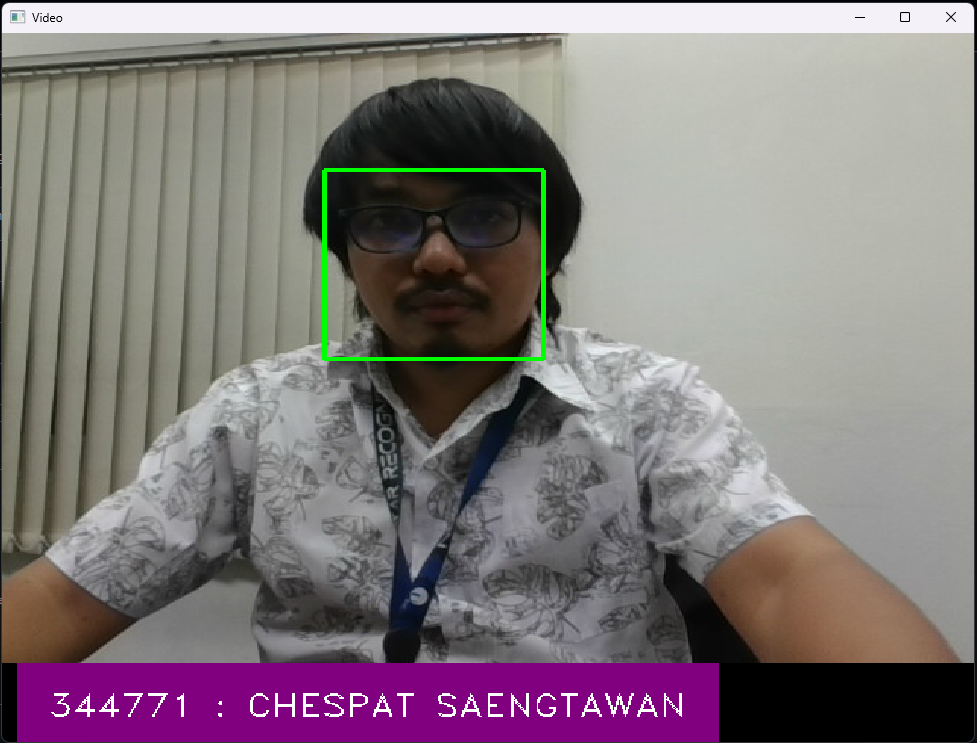

# Face Recognition System

Real-time face recognition system using Python, OpenCV, and face_recognition library.



## Features

- Real-time face detection and recognition
- Full-screen display mode
- Employee database integration via CSV
- Display of employee ID (EN) and name
- Purple-themed display bar for recognized faces

## Requirements

- Python 3.11+
- OpenCV
- face_recognition
- dlib
- numpy
- pandas
- Pillow

## Installation

1. Clone the repository:
```bash
git clone https://github.com/chespathsaengtawan@gmail.com/FaceRecognition.git
cd FaceRecognition
```

2. Create and activate virtual environment:
```bash
python -m venv venv
.\venv\Scripts\activate
```

3. Install required packages:
```bash
pip install cmake
pip install dlib
pip install face_recognition
pip install opencv-python
pip install pandas
pip install Pillow
```

4. Install face_recognition_models:
```bash
pip install git+https://github.com/ageitgey/face_recognition_models
```

## Data Format

Create a CSV file named `emp.csv` in the `data` folder with the following columns:
- EN: Employee ID
- NAME: Employee Name
- IMAGE_BINARY: Base64 encoded image data

## Usage

1. Prepare the employee database:
   - Create `data` folder
   - Add `emp.csv` with required columns
   - Ensure images are properly encoded in Base64 format

2. Run the application:
```bash
python app.py
```

## Controls

- Press 'f' to toggle fullscreen mode
- Press 'x' to exit the application

## Features Details

- Face Detection: Detects faces in real-time using webcam
- Face Recognition: Matches detected faces with employee database
- Display: Shows employee ID and name in purple display bar
- Performance: Optimized for real-time processing

## Troubleshooting

- Ensure webcam is properly connected
- Check if `data/emp.csv` exists and has correct format
- Verify Base64 image encoding is valid
- Make sure all dependencies are properly installed

## License

This project is licensed under the MIT License.

## Author

[chespathsaengtawan@gmail.com]

## Acknowledgments

- face_recognition library by Adam Geitgey
- OpenCV community
- dlib library